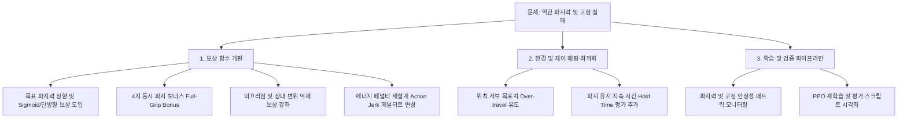

# 4지 텐던 손가락 로봇 파지력 강화 및 물체 고정 개선 사전 계획서

## 1. 현상 및 핵심 원인 분석

현재 학습된 정책은 손가락 끝이 큐브 표면에 도달하는 것(도달/접촉)까지는 학습되었으나, **파지력이 매우 약하고 큐브가 안정적으로 고정되지 않는 현상**이 발생. `scripts/` 디렉토리 코드를 확인 결과, 다음 4가지 핵심 원인이 파악.

---

### 원인 1: 보상 함수 구조적 한계 (과도하게 낮고 협소한 목표 파지력)
- **위치**: `scripts/reward_function.py`
  ```python
  @dataclass
  class RewardConfig:
      target_force: float = 1.0   # F_target = 1.0 N
      sigma_f: float = 1.0
  
  def compute_r_grip(contacts: dict[str, dict], cfg: RewardConfig) -> float:
      ...
      return float(np.exp(-abs(f_t - cfg.target_force) / cfg.sigma_f))
  ```
- **문제점**:
  1. 목표 힘($F_{target}$)이 **1.0 N**으로 지나치게 약합니다.
  2. 종형(Bell-shaped / Exponential) 오차 함수 구조로 인해, 손가락이 큐브를 단단히 쥐기 위해 1.0 N보다 강한 힘(예: 3~10 N)을 가하면 **오히려 보상이 급격히 감소(페널티)**합니다.
  3. 또한 접촉이 전혀 없을 때(`f_t = 0.0`)조차 `exp(-1) ≈ 0.368`의 보상을 무조건 얻게 되어, 강하게 쥐기보다는 '살짝 스치는(Feather touch)' 행동이 최적해로 학습됩니다.

---

### 원인 2: 위치 서보(PD) 메커니즘과 제어 목표점(Over-travel)의 부재
- **위치**: `scripts/finger_robot_env.py`
  ```python
  ctrl_low = self.model.actuator_ctrlrange[:, 0]
  ctrl_high = self.model.actuator_ctrlrange[:, 1]
  target_position = ctrl_low + (clipped_action + 1.0) * 0.5 * (ctrl_high - ctrl_low)
  ```
- **문제점**:
  - MuJoCo 모델의 액추에이터는 위치 서보(`tendons.xml`: `kp="50"`)로 구성되어 있습니다.
  - 위치 제어기에서 수직 항력(파지력 $F$)은 **목표 위치와 실제 접촉 위치 사이의 오차**($F = k_p \times \Delta x$)에 비례하여 발생합니다.
  - 현재 정책이 큐브 표면 위치에 정확히 도달하는 순간 제어 입력을 멈추면($\Delta x \approx 0$), 위치 오차가 없어 **발생하는 쥐는 힘이 0에 수렴**합니다.
  - 물체를 단단히 파지하려면 손가락이 큐브 표면보다 더 깊은 안쪽을 목표(Over-travel setpoint)로 지속적으로 당기도록 유도되어야 합니다.

---

### 원인 3: 단일 손가락 접촉과 4지 동시 고정(Force Closure)의 보상 불균형
- **위치**: `scripts/reward_function.py`
  ```python
  def compute_r_contact(contacts: dict[str, dict]) -> float:
      return len(contacts) / N_FINGER
  ```
- **문제점**:
  - 단순히 접촉한 손가락 수 비율만 계산하므로, 2~3개 손가락만 닿아 있어도 점수를 획득합니다.
  - 물체가 고정되려면 4개 손가락이 서로 마주보며 반대 방향의 힘을 상쇄하는 **대칭적 파지 균형(Force Closure)**이 형성되어야 하나, 이를 유도하는 보너스나 조건이 없습니다.

---

### 원인 4: 행동 지속에 대한 에너지 페널티 간섭
- **위치**: `scripts/reward_function.py`
  ```python
  P_energy = sum_i |a_i,t|   # w4 = 0.01
  ```
- **문제점**:
  - 파지를 유지하기 위해서는 액션($a_i \approx +1.0$)을 지속적으로 높은 값으로 유지해야 합니다.
  - `|a_i|`에 대한 페널티가 파지 상태 유지와 상충되어, 불필요하게 힘을 빼거나 떨리는(chattering) 원인이 될 수 있습니다.

---

## 2. 세부 개선 계획




### 1단계: 보상 함수 구조 전면 개편 (`scripts/reward_function.py`)

1. **파지력 보상 ($R_{grip}$) 함수 형태 변경**
   - **기존**: $R_{grip} = \exp\left(-\frac{|F_t - 1.0|}{1.0}\right)$ (1N 초과 시 감점되는 치명적 문제)
   - **개선안**:
     - 목표 파지력($F_{target}$)을 실기 및 시뮬 환경에 맞게 **5.0 N ~ 8.0 N** 수준으로 상향.
     - 하한선 기준 단방향 보상 또는 Sigmoid 형태 채택:
       $$R_{grip} = \text{clip}\left(\frac{F_t}{F_{target}}, 0.0, 1.0\right)$$
       또는 충분한 힘($F \ge F_{min}$)이 가해졌을 때 최대 1.0의 보상을 부여하고, 과도한 파괴적 힘($F > F_{max}$)에 대해서만 제한적으로 완화.
     - 접촉이 없을 때는 **명시적으로 0점** 처리.

2. **4지 동시 밀착 고정 보너스 ($R_{full\_hold}$)**
   - 4개 손가락이 모두 큐브와 접촉하고, 각 손가락의 수직 항력이 임계값($F_{threshold} \ge 2.0\text{ N}$) 이상일 때 추가 가중치(예: $+2.0$) 부여.
   - 대칭 축(Right-Left, Front-Back) 간의 힘 균형도를 측정하여 한쪽으로 큐브가 밀려나지 않도록 유도.

3. **미끄러짐 및 안정성 ($P_{slip}$) 강화**
   - 접촉 지점의 위치 변화량($\Delta p_{contact}$) 페널티를 강화하여, 큐브를 누른 채로 손가락 끝이 미끄러지는 현상 억제.

4. **행동 평활화 페널티 ($P_{smooth}$)로 전환**
   - 크기 자체를 억제하는 `sum |a|` 대신, 시간에 따른 행동 급변을 억제하는 Action Jerk 페널티 $\sum |a_t - a_{t-1}|^2$를 적용하여 강한 쥐기 자세를 지속 유지할 수 있도록 보장.

---

### 2단계: 환경 및 파지 유지(Hold) 로직 개선 (`scripts/finger_robot_env.py`)

1. **종료 조건(Termination) 재정의**
   - 현재 `progress > 0.98`로 끝나버리는 방식은 파지 후 물체를 고정하는 능력을 학습하지 못하게 만듭니다.
   - **개선**: 조기 종료를 제거하거나, 큐브와의 4지 접촉 및 파지력이 안정화된 후 일정 스텝 동안 유지하는 "파지 지속 태스크" 구조로 정립.
2. **평가 지표 (Info Metrics) 확장**
   - 에피소드 스텝마다 `mean_normal_force`, `num_active_contacts`, `slip_distance`, `is_grasped`를 `info` 딕셔너리에 반환하여 파지 상태를 명확히 관측 가능하게 함.

---

### 3단계: 학습 및 검증 파이프라인 (`scripts/train.py`, `scripts/evaluate.py`)

1. **Callback 저장 기준 업데이트**
   - 단순 에피소드 총점뿐만 아니라, **평균 파지력 및 파지 유지 성공률(Grasp Success Rate)**을 기록.
2. **시각화 및 평가 스크립트 연동**
   - `evaluate.py` 실행 시 화면 상단 또는 터미널에 실시간 4지 접촉력(N)을 출력하여 파지 강도와 고정 여부를 직관적으로 검증.

---

## 3. 수정 대상 파일 및 변경 범위 요약

| 파일 | 주요 수정 사항 | 기대 효과 |
|---|---|---|
| [scripts/reward_function.py](../scripts/reward_function.py) | • $F_{target}$ 상향 및 보상 수식 개선<br>• 4지 동시 파지 보너스 추가<br>• 에너지 페널티를 Jerk 페널티로 대체 | 강하게 쥐고 균형 있게 고정하는 최적 정책 유도 |
| [scripts/finger_robot_env.py](../scripts/finger_robot_env.py) | • 종료 조건(progress > 0.98) 재검토<br>• 모니터링 메트릭(파지력, 접촉 상태) 추가 | 파지 유지(Hold) 능력 학습 및 디버깅 용이성 확보 |
| [scripts/train.py](../scripts/train.py) | • 파지력 중심의 검증 지표 로깅 추가 | 가장 단단하게 고정한 모델 체크포인트 선별 |
| [scripts/evaluate.py](../scripts/evaluate.py) | • 실시간 4지 접촉력 및 고정 안정성 출력 | 학습 결과 육안 및 수치 검증 |

---

## 4. 진행 권장 순서

1. **사용자 확인 및 요구 파지력 범위 협의**:
   - 목표 파지력($F_{target}$) 기준값 (예: 5N ~ 10N) 및 허용 범위 확정.
2. **`reward_function.py` 수정**:
   - 파지력 계산식 및 페널티 항 리팩토링.
3. **`finger_robot_env.py` 보완**:
   - 유지(Hold) 스텝 환경 설정 및 세부 메트릭 추가.
4. **학습 테스트 및 파지력/고정력 검증**:
   - 짧은 스텝 사전 학습 실행 후 `evaluate.py`로 접촉력 모니터링 확인.
